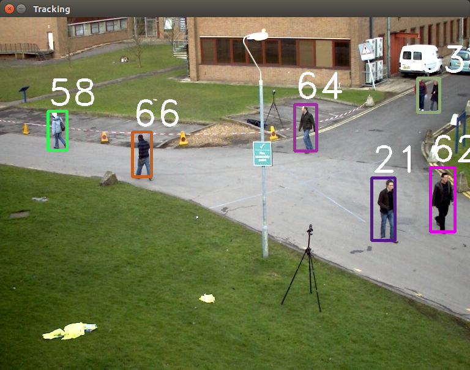

## Introduction
C++ implementation of SORT: Simple, online, and real-time tracking of multiple objects in a video sequence.

Kuhn-Munkres (Hungarian) Algorithm in C++ is forked from:
https://github.com/saebyn/munkres-cpp

## Dependencies
- Ubuntu 18.04
- OpenCV 4.2
- Boost 1.58.0
- 3090 RTX GPU

> All of the 3rd party libraries are included in the provided docker image

## Build Docker Image
- intflow/nvidia-odtk:3090_Rsort

## Docker run
```bash
#!/bin/bash
#X11

#sudo bash attach_NAS_ftp.sh
sudo xhost +local:root

#Mount Data folders
sudo mkdir /DL_data_big
sudo mount 192.168.0.18:/DL_data_big /DL_data_big

#Run Dockers for CenterNet+DeepSORT
sudo docker run --name oadnet_neck \
--gpus all --rm -p 6433:6433 \
--mount type=bind,src=/home/intflow/works,dst=/works \
--mount type=bind,src=/DL_data_big,dst=/DL_data_big \
--net=host \
--privileged \
--ipc=host \
-it intflow/nvidia-odtk:3090_Rsort /bin/bash
```

## install library
```bash
apt-get install libboost-all-dev -y 
apt-get install libeigen3-dev
apt-get install build-essential gdb
```

## Python info 
- -b cow_tr3_r18_neck_Rsort https://github.com/intflow/nvidia-odtk-workspace.git

## Demo:




To run the tracker with the provided detections and visualize the results:

1. Download the [2D MOT 2015 benchmark dataset](https://motchallenge.net/data/2D_MOT_2015/#download)

2. 1번 다운로드가 안되면, Nas server 안에 있는 것 활용할 것
    ```bash
    /DL_data_big/MOT_image/MOT15
    ```

2. Create a symbolic link to the dataset
    ```bash
    $ ln -s /path/to/MOT2015_challenge/data/MOT15 /path/to/sort-cpp/mot_benchmark
    ```
3. Run the demo
    ```bash
    $ cd /path/to/sort-cpp
    $ mkdir build && cd "$_"
    $ cmake .. && make
    $ cd /path/to/sort-cpp/bin
    # Without display
    $ ./sort-cpp
    # With display
    $ ./sort-cpp -d
    ```


## Evaluate Metrics

Using the [Python implementation of metrics for benchmarking multiple object trackers (MOT)](https://github.com/cheind/py-motmetrics) to evaluate metrics. 


#### Dataset Structure

```
Layout for ground truth data
    <GT_ROOT>/<SEQUENCE_1>/gt/gt.txt
    <GT_ROOT>/<SEQUENCE_2>/gt/gt.txt
    ...

Layout for test data
    <TEST_ROOT>/<SEQUENCE_1>.txt
    <TEST_ROOT>/<SEQUENCE_2>.txt
    ...

Example:
mot_benchmark
├── test
│   ├── ADL-Rundle-6.txt
│   └── ADL-Rundle-8.txt
└── train
    ├── ADL-Rundle-6
    │   └── gt
    │       └── gt.txt
    └── ADL-Rundle-8
        └── gt
            └── gt.txt


Sequences of ground truth and test will be matched according to the `<SEQUENCE_X>`
string.
```

## References
1. https://github.com/abewley/sort
2. https://github.com/mcximing/sort-cpp
3. https://github.com/saebyn/munkres-cpp
